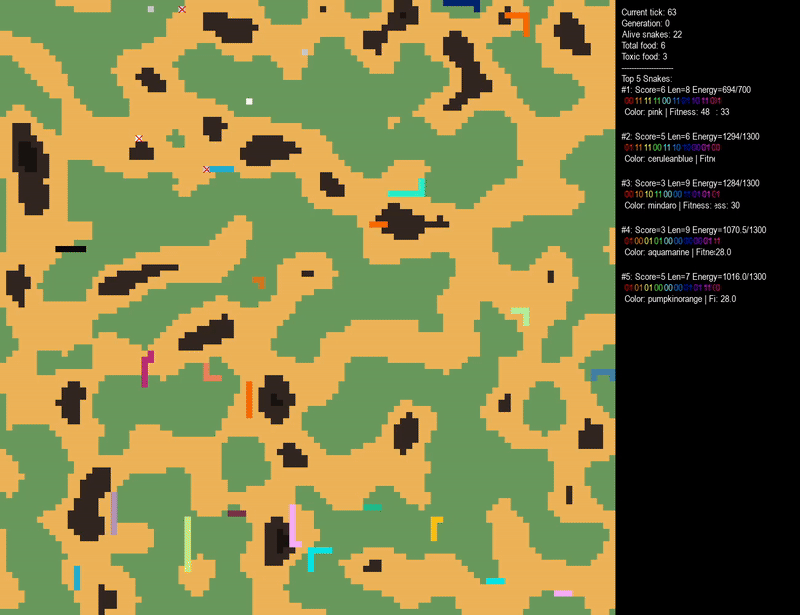
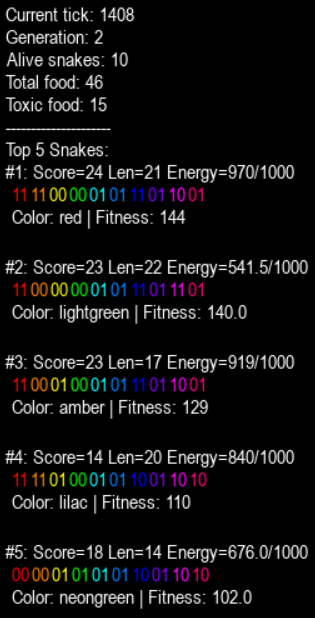
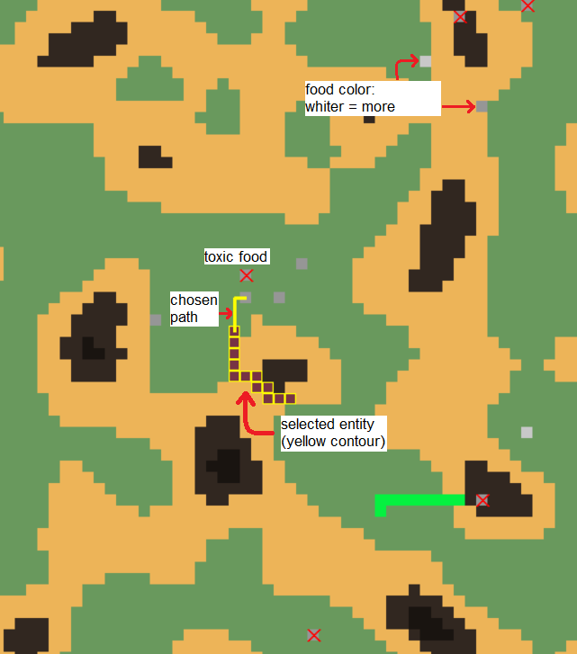
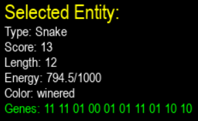
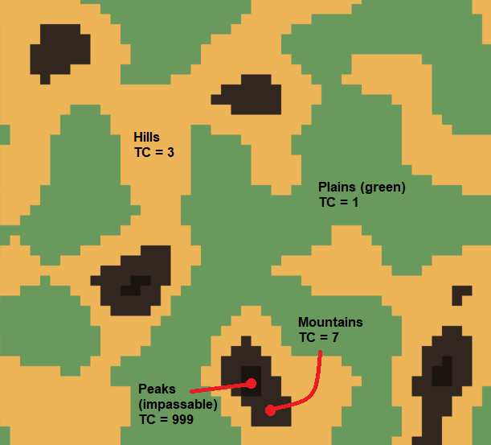

# MultiSnake — A Genetic Algorithm–Powered Snake Game Simulation

## Purpose
This project explores how different search strategies and behaviors affect the survival and evolution of snakes controlled by encoded genes. Both the snakes and their prey evolve over generations in a dynamic environment.

## Features
- Multiple snakes, each controlled by an independent AI agent.
- Random map generation using Perlin noise, affecting terrain movement costs.
- Four main pathfinding strategies: Greedy, BFS, UCS, and A*.
- Each snake has **10 genes** in total, expressed in pairs of 2 bits:
  - 2 meta-genes controlling evolutionary flow
  - 6 behavior genes controlling decision-making
  - 2 physiology genes defining passive traits
- **78,732** unique phenotypes possible.

## Overview

### Controls and UI guide
- Press SPACEBAR to PAUSE/UNPAUSE
- You can see all the global stats of the current generation on the right side of the screen:

- Click on an entity - food or snake, to see its data (easier to do when the game is paused or when `core.config.FPS` is set to a low value)

- On the world map, a tile's color depends on its terrain cost (TC):

### Architecture
The project code is separated in 3 modules:
- [core](./game/core/) - contains core data that controls the simulation's flow:
    - [algorithms.py](./game/core/algorithms.py): pathfinding functions (each returning a path) and several helper functions used in pathfinding
    - [config.py](./game/core/config.py): configuration variables
    - [genes.py](./game/core/genes.py): gene expression and decoder dictionaries, helper functions for gene extraction, crossover etc.
- [entities](./game/entities/) - contains the entity classes:
    - [food.py](./game/entities/food.py): food class
    - [snake.py](./game/entities/snake.py): snake class - methods that control movement decisions, fallback movements etc.
- [simulation](./game/simulation/) - contains code needed for the game world to function: general logic, graphics etc.
    - [controller.py](./game/simulation/controller.py): the main file of the project, it controls the global flow of the simulation
    - [renderer.py](./game/simulation/renderer.py): a special class that is responsible for all in-game graphics
    - [world.py](./game/simulation/world.py): responsible for map generation and spawning food

There are several other files that may be of interest:
- [calculation.md](./calculation.md) contains my notes regarding the fine-tuning of configurable world parameters in order to keep the simulation running smoothly
- [plot.ipynb](./plot.ipynb) is a notebook that contains some simple plots for visualising a simulation session's evolution
- [snake_log.txt](./snake_log.txt) contains data about the top 3 snakes in each generation

### Gene encoding and expression
Each snake has a 20-bit chromosome, with 10 genes in total. Each gene is encoded in a pair of 2 bits (so an int value between 0 and 3). 
9/10 genes have 3 possible expressions, while the algorithm gene has 4 possible expressions - thus the $4 \times 3^9 = 78,732$ possible phenotypes. 
Each gene can be extracted using the `extract(chromosome, start, length)` function. It can then be decoded using `LAYOUT` and `DECODER` dictionaries - all of them in the `core.genes` file.

### Gene layout
Each gene is encoded in 2 bits and appears in the chromosome in the following order:
1. Algorithm (ALG) - pathfinding algorithm used, behavior gene
2. Vision Range (VR) - radius of vision, behavior gene
3. Gene Dominance (GD) - crossover bias, meta-gene
4. Mutability (MUT) - chance to mutate, meta-gene
5. Exploration (EX) - chance of exploring in the absence of food, behavior gene
6. Energy (EN) - maximum and starting energy, physiology gene
7. Timidity (TM) - avoidance of other snakes, behavior gene
8. Toxic Reaction (TREA) - reaction to toxic food, behavior gene
9. Toxic Resistance (TRES) - toxic debuff scaling factor, physiology gene
10. Food Preference (FP) - preference for high or low energy food, behavior gene

Here is an example of a chromosome, its genes and their expressions:
| Gene  | ALG | VR | GD   | MUT  | EX   | EN   | TM | TREA   | TRES | FP   |
|-------|-----|----|------|------|------|------|----|--------|------|------|
| **Value** | 11  | 10 | 00   | 01   | 01   | 11   | 10 | 00     | 01   | 01   |
| **Trait** | A*  | 15 | -0.1 | 0.15 | 0.25 | 1300 | 1  | ignore | 1.0  | none |

In other words, a snake with the chromosome $11100001011110000101$ will:
- use A* for finding its prey
- have a vision range of 15 tiles
- have a gene dominance bias of -10% (its genes are less likely to be passed on)
- have a mutability of 15% (after being born, this snake had a 15% chance of mutating)
- have a 25% chance of exploring randomly when no food is present
- have 1300 energy units (it will not be able to get more than that)
- have a timidity of 1 (will avoid 1 tile around other snakes)
- be unable to differentiate toxic and non-toxic food (toxic reaction: ignore)
- have neither resistance nor vulnerability to toxicity (x1 scaling factor)
- have no food preference (will not prioritise food based on its energy value)

### Evolution process
In this simulation, it follows the standard selection-reproduction-mutation stages.
The chosen method of selection is **Truncation Selection**, as it is used in real life when breeding farm animals or simulating flora and fauna ecosystems.
This means that only the **top 20%** of the population will have the right to reproduce. This percentage is modified based on the surviving population.

### Possible improvements:
- The code needs better organization, it is kind of chaotic (e.g. move `World.spawn_food()` to `Controller`)
- The chromosomes of both snakes and foods could be expanded, adding more variation and behaviour possibilities
- Graphics could be improved by using sprites instead of simple tiles
- Stats display could be improved in order to be more visually appealing
- Further finetune parameters (e.g change selection limit from 20% to 25%)

Any advice or ideas are welcome - feel free to PR and recommend fixes, improvements etc.

## Documentation
Full documentation will be available [here](./docs.md) (WiP for now).

## License
This project is licensed under the [MIT License](./LICENSE).
Feel free to use, modify, and distribute this project as long as proper attribution is provided.